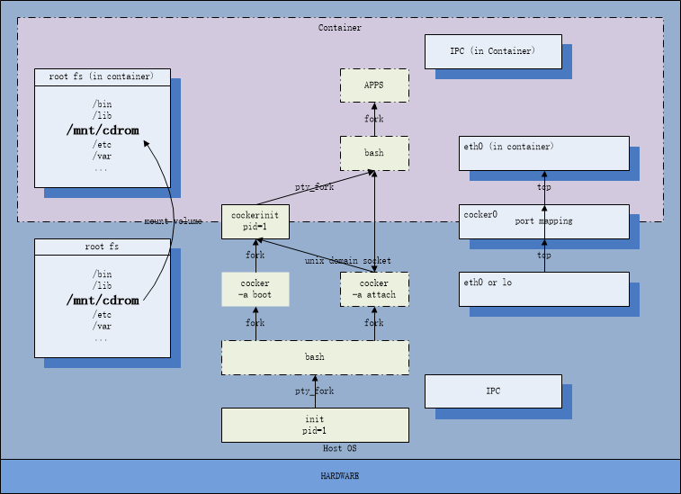
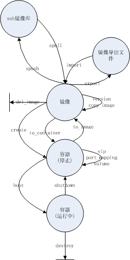
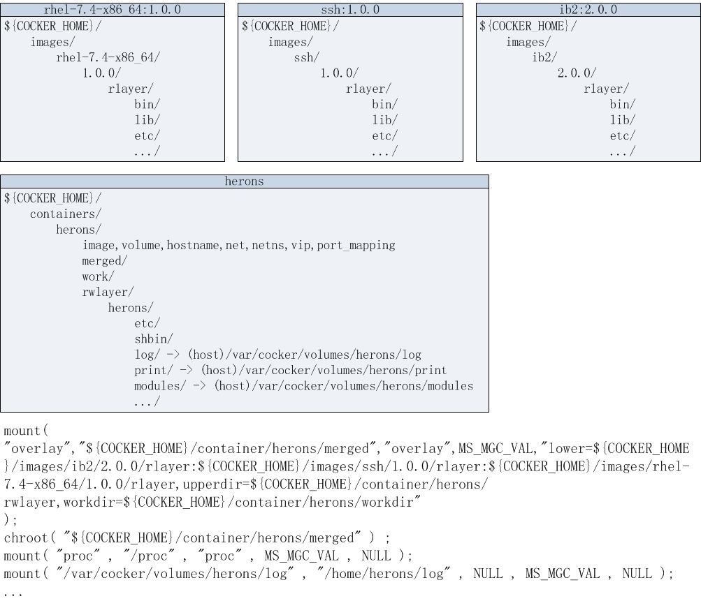
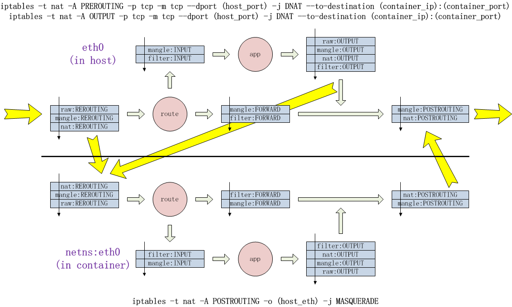
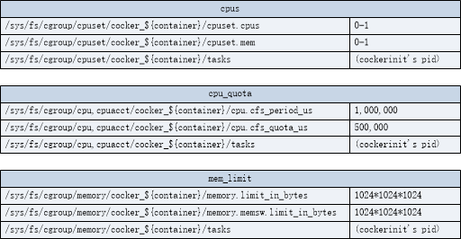
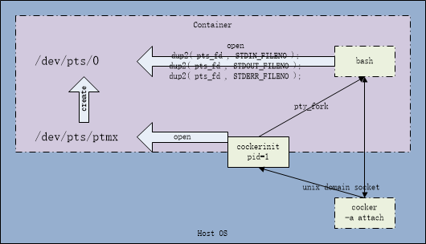

容器引擎(cocker)
===================

<!-- TOC -->

- [1. 概述](#1-概述)
    - [1.1. cocker是什么？](#11-cocker是什么)
    - [1.2. 系统架构](#12-系统架构)
        - [1.2.1. 状态迁移图](#121-状态迁移图)
        - [1.2.2. 层叠文件系统](#122-层叠文件系统)
        - [1.2.3. 网络](#123-网络)
        - [1.2.4. 系统资源限制](#124-系统资源限制)
        - [1.2.5. 伪终端](#125-伪终端)
    - [1.3. 快速使用](#13-快速使用)
- [2. 安装](#2-安装)
    - [2.1. Linux源码编译](#21-linux源码编译)
        - [2.1.1. 确认依赖包已安装](#211-确认依赖包已安装)
        - [2.1.2. 确认内核转发功能已开启](#212-确认内核转发功能已开启)
        - [2.1.3. 准备cocker源码](#213-准备cocker源码)
        - [2.1.4. 编译安装](#214-编译安装)
- [3. 使用教程](#3-使用教程)
    - [3.1. cocker指令](#31-cocker指令)
        - [3.1.1. 额外附加选项](#311-额外附加选项)
        - [3.1.2. 查询镜像列表](#312-查询镜像列表)
        - [3.1.3. 由镜像创建容器](#3.1.由镜像创建容器)
        - [3.1.4. 查询容器列表](#3.2.查询容器列表)
        - [3.1.5. 启动容器](#315-启动容器)
        - [3.1.6. 连接容器](#316-连接容器)
        - [3.1.7. 停止容器](#317-停止容器)
        - [3.1.8. 杀死容器](#318-杀死容器)
        - [3.1.9. 销毁容器](#319-销毁容器)
        - [3.1.10. 修改镜像属性](#3110-修改镜像属性)
            - [3.1.10.1. 修改版本号](#31101-修改版本号)
        - [3.1.11. 修改容器属性](#3111-修改容器属性)
            - [3.1.11.1. 修改VIP](#31111-修改vip)
            - [3.1.11.2. 修改容器端口映射](#31112-修改容器端口映射)
            - [3.1.11.3. 修改外挂卷映射](#31113-修改外挂卷映射)
        - [3.1.12. 镜像转换为容器](#3112-镜像转换为容器)
        - [3.1.13. 容器转换为镜像](#31.1.容器转换为镜像)
        - [3.1.14. 复制镜像](#31.2.复制镜像)
        - [3.1.15. 删除镜像](#3115-删除镜像)
        - [3.1.16. 导出镜像](#3116-导出镜像)
        - [3.1.17. 导入镜像](#3117-导入镜像)
        - [3.1.18. 上传镜像到ssh镜像库](#3118-上传镜像到ssh镜像库)
        - [3.1.19. 从ssh镜像库下载镜像](#3119-从ssh镜像库下载镜像)
        - [3.1.20. 上传镜像到cocker自有镜像库](#3120-上传镜像到cocker自有镜像库)
        - [3.1.21. 从cocker自有镜像库下载镜像](#3121-从cocker自有镜像库下载镜像)
        - [3.1.22. 在容器外执行容器内命令](#3122-在容器外执行容器内命令)
        - [3.1.23. 替换容器内文件内容](#3123-替换容器内文件内容)
    - [3.2. 脚本](#32-脚本)
        - [3.2.1. 创建测试镜像根文件系统脚本](#321-创建测试镜像根文件系统脚本)
        - [3.2.2. 创建操作系统基础镜像脚本](#322-创建操作系统基础镜像脚本)
        - [3.2.3. 创建sshd镜像脚本](#323-创建sshd镜像脚本)
        - [3.2.4. 创建gcc镜像脚本](#324-创建gcc镜像脚本)
- [4. 最后](#4-最后)
    - [4.1. 关于cocker](#41-关于cocker)
    - [4.2. 关于作者](#42-关于作者)

<!-- /TOC -->

# 1. 概述

## 1.1. cocker是什么

`cocker`是我个人用C语言完全自研的容器引擎（对标`Docker`），主要解决如下工作场景中的痛点：

* 原生支持多进程架构的容器使用模式，无须引入第三方组件。
* 按虚拟主机方式管理容器，交互式构建镜像，写过复杂Dockerfile的人都深恶痛绝。
* 镜像多版本共存管理。
* （更多...）

`cocker`使用到了以下Linux底层技术：`LXC`、`cgroup`、`overlayfs`、`iptables`、`ptms`等。

## 1.2. 系统架构



在LXC中，容器只是内核命名空间隔离的根进程以及子进程树，隔离域有主机名字、进程空间、根文件系统、IPC、网络等。`cocker`完整的实现了以上所有隔离域，在容器管理设计上倾向于虚拟主机方式，也支持类似`Docker`的单进程方式。

`cocker`自带了容器根进程，负责通过伪终端方式桥接容器内外，而不是必须通过`ssh`。

`cgroup`负责隔离域的系统资源管控，包括CPU、内存等。

### 1.2.1. 状态迁移图



`cocker`镜像可以本地构建或从镜像库上传下载，镜像库目前只支持`ssh`服务端，后续版本中会加入`cocker`原生服务器。

`cocker`镜像允许不同版本共存，创建容器时可以指定镜像版本，或者默认最新版。镜像可以复制和删除，也可以修改版本号。

`cocker`容器创建出来后可以启动、关闭和销毁。修改容器属性如虚拟IP、端口映射和卷映射必须在容器关闭状态下进行。

`cocker`镜像可以转化为`cocker`容器便于交互式修改，然后再转化回来。

### 1.2.2. 层叠文件系统



层叠文件系统是多镜像容器的存储基础，cocker采用overlayfs作为其层叠文件系统引擎，可以叠加几乎无限的镜像层。

`cocker`的镜像和容器等都存放在环境变量`COCKER_HOME`指向的主目录中，所以规划其容量是使用前必须要考虑的问题。如果没有设置环境变量`COCKER_HOME`，则默认指向`/var/cocker`。

`COCKER_HOME`主目录中有镜像主目录`images`、容器主目录`containers`、`ssh`镜像仓库`srepo`，以及日志文件`cocker.log`。

### 1.2.3. 网络



`cocker`支持三种网络模型：HOST、CUSTOM和BRIDGE。

| 网络模型 | 说明 |
|---------|------|
| HOST | 无预置网络环境 |
| CUSTOM | 仅仅预置网络命名空间，不创建容器内外网卡等，由完全由用户自设置 |
| BRIDGE | 预置以NAT方式的容器向宿主机的网络连通方式、自定义多组指定端口映射转发的宿主机向容器的网络连通方式 |

首次执行`cocker`会创建网桥设备`cocker0`，网段为`166.88.0.x`。

### 1.2.4. 系统资源限制



`cocker`目前只实现了CPU核分配、时间片占用百分比分配、内存分配，其它系统资源在后续版本中会逐渐完善。

### 1.2.5. 伪终端



自带容器根进程接受客户端`cocker`连接后会创建伪终端会话，就像登录到虚拟主机上命令交互一样，无需使用`ssh`。

## 1.3. 快速使用

使用主控工具cocker快速创建一个小型测试镜像，里面调用了自带脚本`cocker_install_test.sh`构建根文件系统。

然后使用指令`-a boot`基于刚刚创建的镜像`test`启动一个容器`test`，并且直接打开一个会话连接到容器中的伪终端...退出伪终端后，使用指令`-a shutdown`关闭容器，最后使用指令`-a destroy`销毁容器。

```
# cocker -a install_test
OK
# cocker -s images
image_id                       version    modify_datetime     size      
--------------------------------------------------------------------
test                           _          2018-11-10T09:21:12 24 MB
# cocker -a create -m test -c test
OK
# cocker -a boot -c test -t   
connect to container ok
--- Welcome to cocker contrainer ---

[root@test /root] exit
logout
# cocker -a shutdown -c test
OK
# cocker -a destroy -c test
OK
```

# 2. 安装

## 2.1. Linux源码编译

### 2.1.1. 确认依赖包已安装

```
yum install -y telnet
yum install -y nmap-ncat
yum install -y bridge-utils
yum install -y man-pages
yum install -y supermin5
```

### 2.1.2. 确认内核转发功能已开启

临时开启

```
# echo "1" >/proc/sys/net/ipv4/ip_forward
```

或永久开启

```
# echo "net.ipv4.ip_forward=1" >>/etc/sysctl.conf
# sysctl -p
```

### 2.1.3. 准备cocker源码

下载cocker源码包，解开，进入

```
# tar xvzf cocker-X.X.X.tar.gz
# cd cocker-X.X.X
```

或克隆cocker源码库，进入

```
# git clone https://gitee.com/calvinwilliams/cocker
# cd cocker
```

or

```
# git clone https://github.com/calvinwilliams/cocker
# cd cocker
```

### 2.1.4. 编译安装

注意：如果你在非root用户编译源码，确认`sudo`无需输入密码。

清理中间文件

```
# make -f makefile.Linux clean
make[1]: 进入目录“/home/calvin/src/cocker/shbin”
make[1]: 离开目录“/home/calvin/src/cocker/shbin”
make[1]: 进入目录“/home/calvin/src/cocker/src”
make[2]: 进入目录“/home/calvin/src/cocker/src/util”
rm -f list.o
rm -f LOGC.o
rm -f version.o
rm -f file.o
rm -f string.o
rm -f socket.o
rm -f pts.o
rm -f libcocker_util.so
make[2]: 离开目录“/home/calvin/src/cocker/src/util”
make[2]: 进入目录“/home/calvin/src/cocker/src/cocker”
rm -f util.o
rm -f main.o
rm -f env.o
rm -f show_images.o
rm -f show_containers.o
rm -f action_create.o
rm -f action_destroy.o
rm -f action_boot.o
rm -f action_shutdown.o
rm -f action_version.o
rm -f action_vip.o
rm -f action_port_mapping.o
rm -f action_volume.o
rm -f action_attach.o
rm -f action_install_test.o
rm -f action_to_container.o
rm -f action_to_image.o
rm -f action_copy_image.o
rm -f action_del_image.o
rm -f action_export.o
rm -f action_import.o
rm -f show_ssearch.o
rm -f action_spush.o
rm -f action_spull.o
rm -f cocker
make[2]: 离开目录“/home/calvin/src/cocker/src/cocker”
make[2]: 进入目录“/home/calvin/src/cocker/src/cockerinit”
rm -f main.o
rm -f server.o
rm -f pty.o
rm -f pts_and_tcp_bridge.o
rm -f cockerinit
make[2]: 离开目录“/home/calvin/src/cocker/src/cockerinit”
make[1]: 离开目录“/home/calvin/src/cocker/src”
```

编译并安装到系统目录里

注意：如果你在非root用户编译源码，前面加上`sodu -E`。

```
# make -f makefile.Linux install
make[1]: 进入目录“/home/calvin/src/cocker/src”
make[2]: 进入目录“/home/calvin/src/cocker/src/util”
rm -f list.o
rm -f LOGC.o
rm -f version.o
rm -f file.o
rm -f string.o
rm -f socket.o
rm -f pts.o
rm -f libcocker_util.so
make[2]: 离开目录“/home/calvin/src/cocker/src/util”
make[2]: 进入目录“/home/calvin/src/cocker/src/cocker”
rm -f util.o
rm -f main.o
rm -f env.o
rm -f show_images.o
rm -f show_containers.o
rm -f action_create.o
rm -f action_destroy.o
rm -f action_boot.o
rm -f action_shutdown.o
rm -f action_version.o
rm -f action_vip.o
rm -f action_port_mapping.o
rm -f action_volume.o
rm -f action_attach.o
rm -f action_install_test.o
rm -f action_to_container.o
rm -f action_to_image.o
rm -f action_copy_image.o
rm -f action_del_image.o
rm -f action_export.o
rm -f action_import.o
rm -f show_ssearch.o
rm -f action_spush.o
rm -f action_spull.o
rm -f cocker
make[2]: 离开目录“/home/calvin/src/cocker/src/cocker”
make[2]: 进入目录“/home/calvin/src/cocker/src/cockerinit”
rm -f main.o
rm -f server.o
rm -f pty.o
rm -f pts_and_tcp_bridge.o
rm -f cockerinit
make[2]: 离开目录“/home/calvin/src/cocker/src/cockerinit”
make[1]: 离开目录“/home/calvin/src/cocker/src”
make[1]: 进入目录“/home/calvin/src/cocker/shbin”
make[1]: 离开目录“/home/calvin/src/cocker/shbin”
make[1]: 进入目录“/home/calvin/src/cocker/src”
make[2]: 进入目录“/home/calvin/src/cocker/src/util”
gcc -g -fPIC -O2 -Wall -Werror -fno-strict-aliasing -I. -I/usr/include -I/usr/include -std=gnu99  -c list.c
gcc -g -fPIC -O2 -Wall -Werror -fno-strict-aliasing -I. -I/usr/include -I/usr/include -std=gnu99  -c LOGC.c
gcc -g -fPIC -O2 -Wall -Werror -fno-strict-aliasing -I. -I/usr/include -I/usr/include -std=gnu99  -c version.c
gcc -g -fPIC -O2 -Wall -Werror -fno-strict-aliasing -I. -I/usr/include -I/usr/include -std=gnu99  -c file.c
gcc -g -fPIC -O2 -Wall -Werror -fno-strict-aliasing -I. -I/usr/include -I/usr/include -std=gnu99  -c string.c
gcc -g -fPIC -O2 -Wall -Werror -fno-strict-aliasing -I. -I/usr/include -I/usr/include -std=gnu99  -c socket.c
gcc -g -fPIC -O2 -Wall -Werror -fno-strict-aliasing -I. -I/usr/include -I/usr/include -std=gnu99  -c pts.c
gcc -g -fPIC -O2 -Wall -Werror -fno-strict-aliasing -o libcocker_util.so list.o LOGC.o version.o file.o string.o socket.o pts.o -shared -L. -L/lib64 -L/usr/lib64 -L/usr/lib 
rm -f /lib64/libcocker_util.so
cp -rf libcocker_util.so /lib64/
rm -f /usr/include/cocker_in/list.h
cp -rf list.h /usr/include/cocker_in/
rm -f /usr/include/cocker_in/LOGC.h
cp -rf LOGC.h /usr/include/cocker_in/
rm -f /usr/include/cocker_in/cocker_util.h
cp -rf cocker_util.h /usr/include/cocker_in/
make[2]: 离开目录“/home/calvin/src/cocker/src/util”
make[2]: 进入目录“/home/calvin/src/cocker/src/cocker”
gcc -g -fPIC -O2 -Wall -Werror -fno-strict-aliasing -I. -I/usr/include -I/usr/include -std=gnu99 -I/usr/include/cocker_in  -c util.c
gcc -g -fPIC -O2 -Wall -Werror -fno-strict-aliasing -I. -I/usr/include -I/usr/include -std=gnu99 -I/usr/include/cocker_in  -c main.c
gcc -g -fPIC -O2 -Wall -Werror -fno-strict-aliasing -I. -I/usr/include -I/usr/include -std=gnu99 -I/usr/include/cocker_in  -c env.c
gcc -g -fPIC -O2 -Wall -Werror -fno-strict-aliasing -I. -I/usr/include -I/usr/include -std=gnu99 -I/usr/include/cocker_in  -c show_images.c
gcc -g -fPIC -O2 -Wall -Werror -fno-strict-aliasing -I. -I/usr/include -I/usr/include -std=gnu99 -I/usr/include/cocker_in  -c show_containers.c
gcc -g -fPIC -O2 -Wall -Werror -fno-strict-aliasing -I. -I/usr/include -I/usr/include -std=gnu99 -I/usr/include/cocker_in  -c action_create.c
gcc -g -fPIC -O2 -Wall -Werror -fno-strict-aliasing -I. -I/usr/include -I/usr/include -std=gnu99 -I/usr/include/cocker_in  -c action_destroy.c
gcc -g -fPIC -O2 -Wall -Werror -fno-strict-aliasing -I. -I/usr/include -I/usr/include -std=gnu99 -I/usr/include/cocker_in  -c action_boot.c
gcc -g -fPIC -O2 -Wall -Werror -fno-strict-aliasing -I. -I/usr/include -I/usr/include -std=gnu99 -I/usr/include/cocker_in  -c action_shutdown.c
gcc -g -fPIC -O2 -Wall -Werror -fno-strict-aliasing -I. -I/usr/include -I/usr/include -std=gnu99 -I/usr/include/cocker_in  -c action_version.c
gcc -g -fPIC -O2 -Wall -Werror -fno-strict-aliasing -I. -I/usr/include -I/usr/include -std=gnu99 -I/usr/include/cocker_in  -c action_vip.c
gcc -g -fPIC -O2 -Wall -Werror -fno-strict-aliasing -I. -I/usr/include -I/usr/include -std=gnu99 -I/usr/include/cocker_in  -c action_port_mapping.c
gcc -g -fPIC -O2 -Wall -Werror -fno-strict-aliasing -I. -I/usr/include -I/usr/include -std=gnu99 -I/usr/include/cocker_in  -c action_volume.c
gcc -g -fPIC -O2 -Wall -Werror -fno-strict-aliasing -I. -I/usr/include -I/usr/include -std=gnu99 -I/usr/include/cocker_in  -c action_attach.c
gcc -g -fPIC -O2 -Wall -Werror -fno-strict-aliasing -I. -I/usr/include -I/usr/include -std=gnu99 -I/usr/include/cocker_in  -c action_install_test.c
gcc -g -fPIC -O2 -Wall -Werror -fno-strict-aliasing -I. -I/usr/include -I/usr/include -std=gnu99 -I/usr/include/cocker_in  -c action_to_container.c
gcc -g -fPIC -O2 -Wall -Werror -fno-strict-aliasing -I. -I/usr/include -I/usr/include -std=gnu99 -I/usr/include/cocker_in  -c action_to_image.c
gcc -g -fPIC -O2 -Wall -Werror -fno-strict-aliasing -I. -I/usr/include -I/usr/include -std=gnu99 -I/usr/include/cocker_in  -c action_copy_image.c
gcc -g -fPIC -O2 -Wall -Werror -fno-strict-aliasing -I. -I/usr/include -I/usr/include -std=gnu99 -I/usr/include/cocker_in  -c action_del_image.c
gcc -g -fPIC -O2 -Wall -Werror -fno-strict-aliasing -I. -I/usr/include -I/usr/include -std=gnu99 -I/usr/include/cocker_in  -c action_export.c
gcc -g -fPIC -O2 -Wall -Werror -fno-strict-aliasing -I. -I/usr/include -I/usr/include -std=gnu99 -I/usr/include/cocker_in  -c action_import.c
gcc -g -fPIC -O2 -Wall -Werror -fno-strict-aliasing -I. -I/usr/include -I/usr/include -std=gnu99 -I/usr/include/cocker_in  -c show_ssearch.c
gcc -g -fPIC -O2 -Wall -Werror -fno-strict-aliasing -I. -I/usr/include -I/usr/include -std=gnu99 -I/usr/include/cocker_in  -c action_spush.c
gcc -g -fPIC -O2 -Wall -Werror -fno-strict-aliasing -I. -I/usr/include -I/usr/include -std=gnu99 -I/usr/include/cocker_in  -c action_spull.c
gcc -g -fPIC -O2 -Wall -Werror -fno-strict-aliasing -o cocker util.o main.o env.o show_images.o show_containers.o action_create.o action_destroy.o action_boot.o action_shutdown.o action_version.o action_vip.o action_port_mapping.o action_volume.o action_attach.o action_install_test.o action_to_container.o action_to_image.o action_copy_image.o action_del_image.o action_export.o action_import.o show_ssearch.o action_spush.o action_spull.o -L. -L/lib64 -L/usr/lib64 -L/usr/lib -L/lib64 -lcocker_util -lcrypto 
rm -f /bin/cocker
cp -rf cocker /bin/
make[2]: 离开目录“/home/calvin/src/cocker/src/cocker”
make[2]: 进入目录“/home/calvin/src/cocker/src/cockerinit”
gcc -g -fPIC -O2 -Wall -Werror -fno-strict-aliasing -I. -I/usr/include -I/usr/include -std=gnu99 -I/usr/include/cocker_in  -c main.c
gcc -g -fPIC -O2 -Wall -Werror -fno-strict-aliasing -I. -I/usr/include -I/usr/include -std=gnu99 -I/usr/include/cocker_in  -c server.c
gcc -g -fPIC -O2 -Wall -Werror -fno-strict-aliasing -I. -I/usr/include -I/usr/include -std=gnu99 -I/usr/include/cocker_in  -c pty.c
gcc -g -fPIC -O2 -Wall -Werror -fno-strict-aliasing -I. -I/usr/include -I/usr/include -std=gnu99 -I/usr/include/cocker_in  -c pts_and_tcp_bridge.c
gcc -g -fPIC -O2 -Wall -Werror -fno-strict-aliasing -o cockerinit main.o server.o pty.o pts_and_tcp_bridge.o -L. -L/lib64 -L/usr/lib64 -L/usr/lib -L/lib64 -lcocker_util -lcrypto 
rm -f /bin/cockerinit
cp -rf cockerinit /bin/
make[2]: 离开目录“/home/calvin/src/cocker/src/cockerinit”
make[1]: 离开目录“/home/calvin/src/cocker/src”
make[1]: 进入目录“/home/calvin/src/cocker/shbin”
rm -f /bin/cocker_ldd_and_cp_lib64.sh
cp -rf cocker_ldd_and_cp_lib64.sh /bin/
rm -f /bin/cocker_profile_template.sh
cp -rf cocker_profile_template.sh /bin/
rm -f /bin/cocker_etc_profile_template.sh
cp -rf cocker_etc_profile_template.sh /bin/
rm -f /bin/cocker_install_test.sh
cp -rf cocker_install_test.sh /bin/
rm -f /bin/cocker_create_image_rhel-7.4-x86_64.sh
cp -rf cocker_create_image_rhel-7.4-x86_64.sh /bin/
rm -f /bin/cocker_create_image_rhel-7.4-gcc-x86_64.sh
cp -rf cocker_create_image_rhel-7.4-gcc-x86_64.sh /bin/
make[1]: 离开目录“/home/calvin/src/cocker/shbin”
```

如果没有发生错误则表明编译安装成功，从以上命令行获知：

* 构建出开发内部使用头文件`src/cocker/*.h`安装到`/usr/include/cocker_in`，库文件`libcocker_util.so`安装到`/lib64`。开发内部文件仅用于编译。
* 构建出可执行文件`cocker`、`cockerinit`安装到`/bin`。
* 自带脚本`shbin/*.sh`安装到`/bin`。

# 3. 使用教程

## 3.1. cocker指令

不带选项执行`cocker`将得到所有指令和选项列表

```
# cocker
USAGE : cocker -v
               -s images
               -s containers
               -a create (-m|--image) (image[:version])[,(image[:version])]... [ create options ] [ (-c|--container) (container) ] [ (-b|--boot) [ cgroup options ] [ (-t|--attach) | (-e|--exec) (cmd|"program para1 ...") ] ]
               -a boot (-c|--container) (container) [ cgroup options ] [ (-t|--attach) | (-e|--exec) (cmd|"program para1 ...") ]
               -a attach (-c|--container) (container)
               -a shutdown (-c|--container) (container) [ (-f|--forcely) ]
               -a kill (-c|--container) (container) [ (-f|--forcely) ]
               -a destroy (-c|--container) (container) [ (-f|--forcely) ] [ (-h|--shutdown) ]
               -a version (-m|--image) (image[:version]) [ --version (version) ]
               -a vip (-c|--container) (container) --vip (ip)
               -a port_mapping (-c|--container) (container) --port-mapping (src_port:dst_port)
               -a volume (-c|--container) (container) --volume (host_path[:container_path])[ ...]
               -a to_image --from-container (container) [ --verion (verion) ] --to-image (image)
               -a to_container --from-image (image[:version]) (-m|--image) (image[:version])[,(image[:version])]... [ create options ] --to-container (container)
               -a copy_image --from-image (image[:version]) --to-image (image[:version])
               -a del_image (-m|--image) (image[:version])
               -a import --image-file (file)
               -a export (-m|--image) (image[:version])
               -s ssearch --srepo (user@host)
               -a install_test
create options : [ --volume (host_path:container_path) ][ --volume ... ] [ --host (hostname) ] [ --net (BRIDGE|HOST|CUSTOM) ] [ --host-eth (eth) ] [ --vip (ip) ] [ --port-mapping (src_port:dst_port) ]
cgroup options : [ --cpus [(cpu_num,...)|(cpu_num-cpu_num2)] ] [ --cpu-quota (percent%) ] [ --mem-limit (num|numM) ]
  enable debug : [ (-d|--debug) ]
```

注意：首次执行`cocker`会自动创建镜像主目录`images`、容器主目录`containers`。

### 3.1.1. 额外附加选项

`cocker`选项`-d`用于输出执行时调试信息，但并不是所有调试信息都会输出在屏幕上，某些不方便输出屏幕的信息会记录到日志文件中`cocker.log`，输出到屏幕上的信息也会复制一份到日志文件中。

`cocker`选项`-f`用于强制执行而忽略一些报错，这在一些指令中很有用。

### 3.1.2. 查询镜像列表

使用`cocker`指令`-s images`查询镜像主目录里的所有镜像。

```
# cocker -s images
image_id                       version    modify_datetime     size      
--------------------------------------------------------------------
test                           _          2018-11-10T09:21:12 24 MB
```

镜像目录层次为`镜像名/版本号/镜像目录文件内容`。如果没有版本号，版本号目录名为`_`。

镜像名格式推荐`(个人名或组织名)=(软件名)-(软件版本号)`。版本号格式推荐`x.y.z`。

我们可以使用指令`-a install_test`创建不同版本的测试镜像，多版本共存管理。

```
# cocker -a install_test --version "1.0.0"
OK
# cocker -a install_test --version "1.1.0"   
OK
# cocker -s images
image_id                       version    modify_datetime     size      
--------------------------------------------------------------------
test                           _          2018-11-10T09:21:12 24 MB
test                           1.0.0      2018-11-14T07:20:06 24 MB
test                           1.1.0      2018-11-14T07:20:17 24 MB
```

### 3.1.3. 由镜像创建容器

使用`cocker`指令`-a create`由一个或多个镜像叠加创建容器。

```
# cocker -a create -m test --host test --net BRIDGE --vip 166.88.0.2 --port-mapping 19527:9527 -c test
OK
```

`-m (镜像列表)`:指定镜像列表，镜像名可以以`(镜像名)(:版本号)`格式指定版本号，本指令中允许不指定版本号，`cocker`会自动挑选一个最大版本号的镜像。多个镜像之间用`,`分隔。

`--host (主机名)`:设置容器内的主机名。

`--net (网络模型)`:设置容器网络模型，见前面网络模型章节。

`--vip (ip)`:如果网络模型为`BRIDGE`，设置容器内的网卡IP。

`--port-mapping (网络端口映射列表)`:如果网络模型为`BRIDGE`，设置外部或宿主机访问容器的网络端口映射列表，端口映射格式为`(宿主机端口):(容器端口)`。多个端口映射之间用`,`分隔。

`-c (容器名)`:指定容器名，若不指定，与镜像同名。建议指定。

除了以上示例中用到的选项，以下为其它可选选项：

`--host-eth (网卡名)`:指定宿主机对外网卡名。这在多物理网卡时使用。

`--volume (磁盘卷映射列表)`:磁盘卷映射用于宿主机与容器之间目录共享，设置格式为`(宿主机目录:容器目录)`。多个磁盘卷映射使用各自的选项键前缀`--volume`。

`-b`:容器创建完后立即启动。（后可追加所有启动容器选项）

### 3.1.4. 查询容器列表

使用`cocker`指令`-s containers`查询容器主目录中的所有容器以及状态。

```
# cocker -s containers
container_id         image                hostname   net        netns            size       status
-----------------------------------------------------------------------------------------------------------
test                 test                 test       BRIDGE     nns098F6BCD46    0 B        STOPED
```

容器`test`状态为停止。

### 3.1.5. 启动容器

使用`cocker`指令`-a boot`查询容器主目录中的所有容器以及状态。

```
# cocker -a boot -c test
OK
```

除了以上示例中用到的选项，以下为其它可选选项：

`--cpus (CPU核列表)`:容器限制的CPU核列表，比如第一个CPU核`0`，比如前两个CPU核`0,1`,比如第二个CPU核到第十个CPU核`1-9`。

`--cpu-quota (num%)`:容器限制的CPU利用率，比如完全利用`100%`，比如只能利用四分之一`25%`。

`--mem-limit (numM)`:容器限制的内存容量，比如`100M`。

`-t`:容器启动后立即连接。

`-e (cmd)`:指定容器根进程，默认使用`cocker`自带的`cockerinit`。

启动后再查看容器状态

```
# cocker -s containers  
container_id         image                hostname   net        netns            size       status
-----------------------------------------------------------------------------------------------------------
test                 test                 test       BRIDGE     nns098F6BCD46    0 B        RUNNING(89698)
```

注意：默认启动容器的根进程为`cockerinit`，可简单代替系统`init`进程回收孤儿进程、管理伪终端等功能。

### 3.1.6. 连接容器

如果使用`cockerinit`作为根进程启动容器，使用`cocker`指令`-a attch`连接至容器，`cockerinit`打开一个会话连接到容器中的伪终端。也可叠加ssh镜像在容器内启动ssh服务器，利用ssh连接至容器。

```
# cocker -a attach -c test   
connect to container ok
--- Welcome to cocker contrainer ---

[root@test /root] 
```

注意：测试用镜像`test`已包含了绝大多数必备工具包，但不是所有。

在伪终端中输入`exit`加回车可关闭会话。

```
[root@test /root] exit
logout
#
```

### 3.1.7. 停止容器

使用`cocker`指令`-a shutdown`停止容器。

```
# cocker -a shutdown -c test   
OK
```

```
# cocker -s containers          
container_id         image                hostname   net        netns            size       status
-----------------------------------------------------------------------------------------------------------
test                 test                 test       BRIDGE     nns098F6BCD46    0 B        STOPED
```

### 3.1.8. 杀死容器

使用`cocker`指令`-a kill`强杀容器。

### 3.1.9. 销毁容器

使用`cocker`指令`-a destroy`销毁容器。

注意：销毁容器后容器内所有修改将丢失。

```
# cocker -a destroy -c test
OK
```

除了以上示例中用到的选项，以下为其它可选选项：

`-h`:先停止容器然后马上销毁容器。

`-f`:销毁容器过程中忽略错误，默认会中断销毁过程。

### 3.1.10. 修改镜像属性

#### 3.1.10.1. 修改版本号

使用`cocker`指令`-a version`修改镜像版本号。

```
# cocker -s images
image_id                       version    modify_datetime     size      
--------------------------------------------------------------------
test                           _          2018-11-10T09:21:12 24 MB
# cocker -a version -m test --version "1.0.1"
OK
# cocker -s images
image_id                       version    modify_datetime     size      
--------------------------------------------------------------------
test                           1.0.1      2018-11-10T09:21:12 24 MB
# cocker -a version -d -m "test:1.0.1" --version "1.0.2"
OK
# cocker -s images
image_id                       version    modify_datetime     size      
--------------------------------------------------------------------
test                           1.0.2      2018-11-10T09:21:12 24 MB
# cocker -a version -d -m "test:1.0.2"
OK
# cocker -s images
image_id                       version    modify_datetime     size      
--------------------------------------------------------------------
test                           _          2018-11-10T09:21:12 24 MB
```

### 3.1.11. 修改容器属性

#### 3.1.11.1. 修改VIP

使用`cocker`指令`-a vip`修改容器内网卡IP。

注意：必须容器停止后才能修改。

```
# cocker -a vip --vip 166.88.0.3 -c test
OK
```

#### 3.1.11.2. 修改容器端口映射

使用`cocker`指令`-a port_mapping`修改容器网络端口映射。

注意：必须容器停止后才能修改。

```
# cocker -a port_mapping --port-mapping 19528:9528 -c test
OK
```

#### 3.1.11.3. 修改外挂卷映射

使用`cocker`指令`-a volume`修改容器磁盘卷映射。

注意：必须容器停止后才能修改。

```
# cocker -a volume --volume "/tmp:/tmp" --volume "/mnt/cdrom:/mnt/cdrom" -c test
OK
```

### 3.1.12. 镜像转换为容器

当需要修改镜像内文件时可先把镜像转换为容器，修改完后转换回镜像。

使用`cocker`指令`-a to_container`转换指定镜像为容器。

```
# cocker -a to_container --from-image test --host test --net BRIDGE --vip 166.88.0.2 --port-mapping 19527:9527 --to-container test
OK
```

注意：几乎可使用所有指令`-a create`的选项。

### 3.1.13. 容器转换为镜像

当想把某一容器打包成镜像，可使用此指令。

使用`cocker`指令`-a to_image`转换指定容器为镜像。

注意：转换的容器必须是停止的。

```
# cocker -a to_image --from-container test --to-image test
OK
```

### 3.1.14. 复制镜像

使用`cocker`指令`-a copy_image`可复制镜像。

```
# cocker -a copy_image --from-image test --to-image "test2:1.0.0"
OK
```

### 3.1.15. 删除镜像

使用`cocker`指令`-a del_image`可删除镜像。

```
# cocker -a del_image -m "test2:1.0.0"   
OK
```

### 3.1.16. 导出镜像

使用`cocker`指令`-a export`可导出镜像为镜像打包文件。

```
# cocker -a export -m "test:1.1.0"   
OK
```

### 3.1.17. 导入镜像

使用`cocker`指令`-a import`可从镜像打包文件导入镜像库。

注意：镜像打包文件名扩展名必须是`.cockerimage`。

```
# cocker -a del_image -m "test:1.1.0"
OK
# cocker -a import --image-file "test:1.1.0.cockerimage"   
OK
# cocker -s images
image_id                       version    modify_datetime     size      
--------------------------------------------------------------------
test                           1.1.0      2018-11-14T08:53:13 24 MB
```

### 3.1.18. 上传镜像到ssh镜像库

ssh镜像库是利用ssh服务器来搭建镜像库。首先安装ssh服务器，创建镜像库用户，从客户端产生公钥文件分发给镜像库以方便免密登录。

```
# ssh-keygen -t rsa
...
# ssh-copy-id -i ~/.ssh/id_rsa.pub cockerimages@192.168.6.74
```

使用`cocker`指令`-s ssearch`可查看ssh镜像库里的镜像列表。

```
# cocker -s ssearch --srepo "cockerimages@192.168.6.74"
OK
```

注意：`cocker`保存ssh镜像库地址配置`cockerimages@192.168.6.74`。

还能加上子串通配选项`--match`。

```
# cocker -s ssearch --match test
```

使用`cocker`指令`-a spush`上传镜像到ssh镜像库。

```
# cocker -a spush -m "test:1.0.0"
OK
# cocker -s ssearch --match test
cocker -s ssearch   
image_id                                      modify_datetime     size      
----------------------------------------------------------------------
test:1.0.0                                    2018-11-14T9:05:48  11 MB
```

### 3.1.19. 从ssh镜像库下载镜像

使用`cocker`指令`-a spull`从ssh镜像库下载镜像。

```
# 
cocker -a del_image -m "test:1.0.0"
OK
# cocker -a spull -m "test:1.0.0"
OK
# cocker -s images
image_id                       version    modify_datetime     size      
--------------------------------------------------------------------
test                           1.0.0      2018-11-14T09:09:04 24 MB
```

### 3.1.20. 上传镜像到cocker自有镜像库

（待研发）

### 3.1.21. 从cocker自有镜像库下载镜像

（待研发）

### 3.1.22. 在容器外执行容器内命令

使用`cocker`指令`-a run`在容器外执行容器内命令

```
# cocker -a run -c test --cmd "hostname"
test
#
```

注意：容器必须运行中状态。

### 3.1.23. 替换容器内文件内容

使用`cocker`指令`-a filerpl`替换容器内文件内容

```
# cocker -a filerpl -c test --template-file "/root/tpl.txt" --mapping-file "map.txt" --instance-file "/root/ins.txt"
OK
#
```

`--template-file`和`--instance-file`分别为模板文件和实例化文件，按容器内路径，省略`--instance-file`将替换`--template-file`自己。

`--mapping-file`为替换配置，按容器外路径。一条规则为一行：
```
(KEY) (VALUE)\n
(KEY) (VAL UE)\n
...\n
```

替换示例：

`tpl.txt`
```
{ "leaf":"${LEAF}" }
```

`map.txt`
```
${LEAF} 我的树叶
```

替换后的`ins.txt`
```
{ "leaf":"我的树叶" }
```

注意：容器必须运行中状态。

## 3.2. 脚本

### 3.2.1. 创建测试镜像根文件系统脚本

```
# cocker_install_test.sh
```

注意：应与`cocker`指令`-a install_test`配合使用。

### 3.2.2. 创建操作系统基础镜像脚本

注意：必须可正常使用yum为前提。

```
# cocker_create_image_rhel-7.4-x86_64.sh
```

执行后输入名字和版本号，自动生成可导入的镜像打包文件，文件名格式为`(作者)=(calvin=rhel-7.4-x86_64):(版本号).cockerimage`

### 3.2.3. 创建sshd镜像脚本

此为创建sshd镜像层镜像打包文件。

```
# cocker_create_image_rhel-7.4-sshd-x86_64.sh
```

### 3.2.4. 创建gcc镜像脚本

此为创建gcc镜像层镜像打包文件。

```
# cocker_create_image_rhel-7.4-gcc-x86_64.sh
```

# 4. 最后

## 4.1. 关于cocker

欢迎使用cocker，如果你使用中碰到了问题请告诉我，谢谢 ^_^

源码托管地址 : [开源中国](https://gitee.com/calvinwilliams/cocker)、[github](https://github.com/calvinwilliams/cocker)

## 4.2. 关于作者

厉华，主手C，写过小到性能卓越方便快捷的日志库、HTTP解析器、日志采集器等，大到交易平台/中间件等，分布式系统实践者，容器技术爱好者，目前在某城商行负责基础架构。

通过邮箱联系我 : [网易](mailto:calvinwilliams@163.com)、[Gmail](mailto:calvinwilliams.c@gmail.com)
